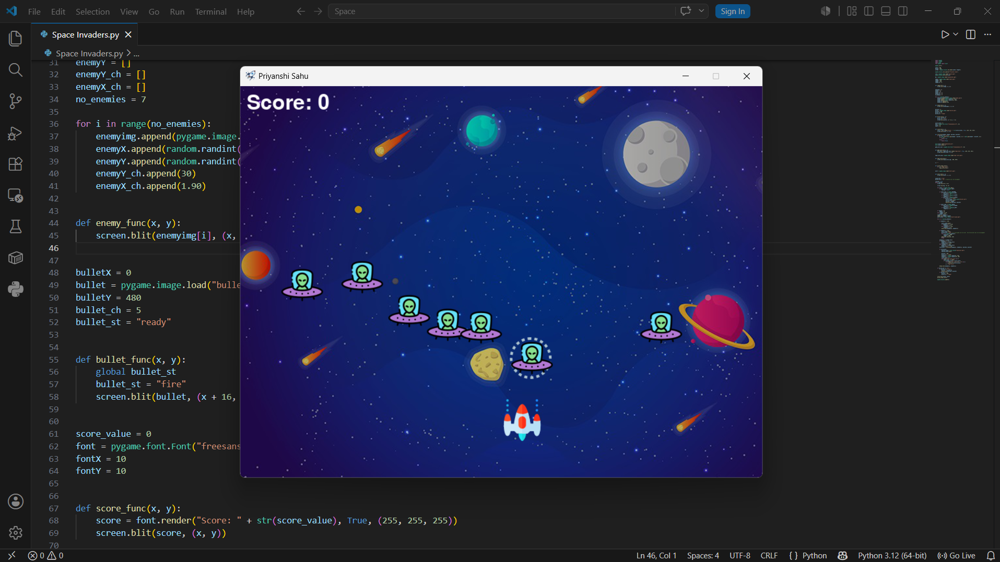

# 🚀 Space Invaders

A classic Space Invaders game built with Python and Pygame.

## 📸 Screenshot



## ✨ Features

- Control the spaceship using the keyboard
- Shoot enemies with spacebar
- Multiple enemies with random spawning
- Collision detection
- Score tracking
- High score saved locally
- Background music and sound effects
- Game Over screen

## 🛠️ Built With

- Python
- Pygame

## 🎮 Controls

| Key | Action |
|-----|--------|
| ← | Move Left |
| → | Move Right |
| Space | Fire Bullet |

## 🚀 How to Run

1. Clone the repository

```bash
git clone https://github.com/sonalpriyanshi529/Space-Invaders.git
```

2. Open the project folder

```bash
cd Space-Invaders
```

3. Install Pygame

```bash
pip install pygame
```

4. Run the game

```bash
python space_invaders.py
```

> **Note:** Make sure all image, sound, and asset files are present in the project folder before running the game.

## 📄 License

This project is licensed under the MIT License.
